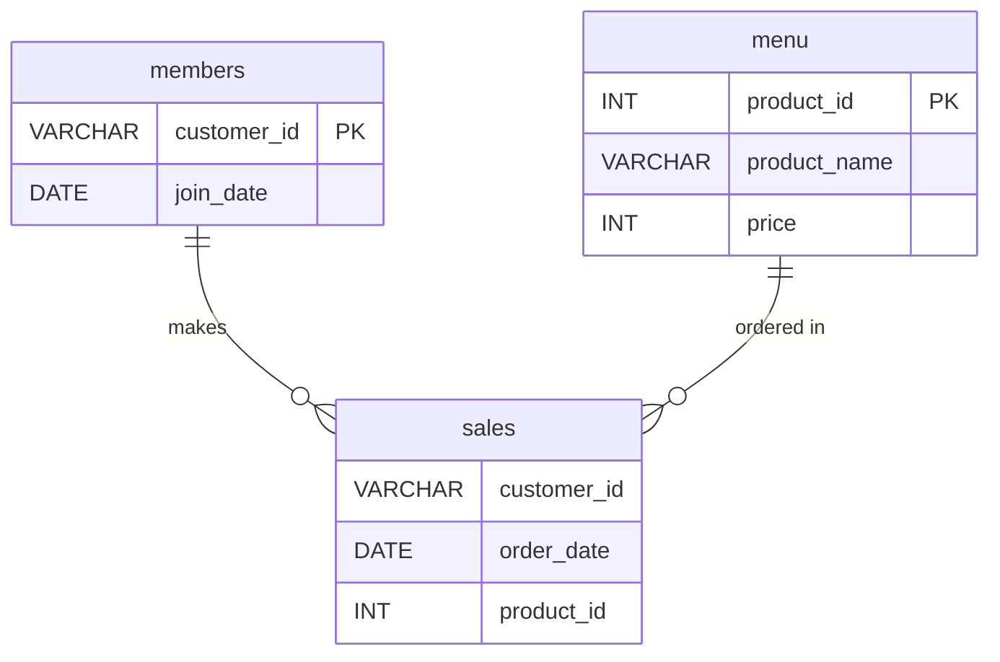

# 🍜 Case Study #1: Danny's Diner

A comprehensive SQL analysis for Danny's Diner from the **[8-Week SQL Challenge](https://8weeksqlchallenge.com/case-study-1/)** to extract actionable business insights on customer visiting patterns, spending habits, favorite menu items, and loyalty program performance.

---

## � Quick Links
* 🛠️ **Database Setup Script:** [`setup.sql`](./setup.sql) — Contains DDL schema and dataset insertions.
* 💻 **Complete Solutions Script:** [`solutions.sql`](./solutions.sql) — Contains all executable PostgreSQL query solutions.

---

## 📌 Table of Contents
* [Quick Links](#-quick-links)
* [Business Task](#business-task)
* [Database Schema & ERD](#database-schema--erd)
* [Solutions & Business Insights](#solutions--business-insights)
  * [Q1. Total amount spent by each customer](#q1-what-is-the-total-amount-each-customer-spent-at-the-restaurant)
  * [Q2. Number of days visited](#q2-how-many-days-has-each-customer-visited-the-restaurant)
  * [Q3. First item purchased by each customer](#q3-what-was-the-first-item-from-the-menu-purchased-by-each-customer)
  * [Q4. Most purchased item on the menu](#q4-what-is-the-most-purchased-item-on-the-menu-and-how-many-times-was-it-purchased-by-all-customers)
  * [Q5. Most popular item for each customer](#q5-which-item-was-the-most-popular-for-each-customer)
  * [Q6. First item purchased after becoming a member](#q6-which-item-was-purchased-first-by-the-customer-after-they-became-a-member)
  * [Q7. Item purchased just before becoming a member](#q7-which-item-was-purchased-just-before-the-customer-became-a-member)
  * [Q8. Total items and amount spent before joining](#q8-what-is-the-total-items-and-amount-spent-for-each-member-before-they-became-a-member)
  * [Q9. Total customer points with sushi multiplier](#q9-if-each-1-spent-equates-to-10-points-and-sushi-has-a-2x-points-multiplier---how-many-points-would-each-customer-have)
  * [Q10. First-week membership bonus points in January](#q10-in-the-first-week-after-a-customer-joins-the-program-including-their-join-date-they-earn-2x-points-on-all-items---how-many-points-do-customer-a-and-b-have-at-the-end-of-january)
* [Key Strategic Takeaways](#key-strategic-takeaways)

---

## 💼 Business Task

Danny wants to understand his customers' visiting patterns, how much money they have spent, and their favorite menu items. These insights will help him deliver a personalized customer experience and decide whether to expand his existing customer loyalty program.

---

## 📊 Database Schema & ERD

The database consists of three core tables (see [`setup.sql`](./setup.sql) for table creation and sample data):
* **`sales`:** Captures transaction records with `customer_id`, `order_date`, and `product_id`.
* **`menu`:** Maps `product_id` to `product_name` and `price`.
* **`members`:** Tracks `customer_id` and their specific loyalty `join_date`.



---

## 🧠 Solutions & Business Insights

> 💡 **Note:** All queries below can be executed directly via [`solutions.sql`](./solutions.sql).

### Q1. What is the total amount each customer spent at the restaurant?

```sql
SELECT 
    s.customer_id, 
    SUM(m.price) AS total_amount_spent
FROM 
    sales s
JOIN 
    menu m
ON 
    s.product_id = m.product_id
GROUP BY 
    s.customer_id;
```

**Output:**

| customer_id | total_amount_spent |
| ----------- | ------------------ |
| B           | 74                 |
| C           | 36                 |
| A           | 76                 |

**Insight:**
* **Customer A** is the most profitable customer having spent the highest total amount (**$76**), closely followed by **Customer B** (**$74**).
* **Customer C** spent the least (**$36**).
* Danny should focus on retaining Customer A and B as high-value customers while creating incentive programs to grow spend from Customer C.

---

### Q2. How many days has each customer visited the restaurant?

```sql
SELECT 
  customer_id,
  COUNT(DISTINCT order_date) AS
  days_visited
FROM
  sales
GROUP BY customer_id;
```

**Output:**

| customer_id | days_visited |
| ----------- | ------------ |
| A           | 4            |
| B           | 6            |
| C           | 2            |

**Insight:**
* **Customer B** shows the highest visit frequency (visited on **6 distinct days**).
* **Customer A** visited on **4 days**, while **Customer C** visited on **2 days**.
* Customer C is a prime target for promotional campaigns and reminders aimed at increasing repeat visits.

---

### Q3. What was the first item from the menu purchased by each customer?

```sql
-- Optimal and Flexible Solution
WITH ranked_sales_CTE AS (
	SELECT *, DENSE_RANK() OVER(PARTITION BY customer_id ORDER BY order_date) AS ranking
	FROM sales
)
SELECT
	DISTINCT s.customer_id, m.product_name
FROM
	ranked_sales_CTE s
JOIN
	menu m
ON s.product_id = m.product_id
WHERE ranking = 1;
```

**Output:**

| customer_id | product_name |
| ----------- | ------------ |
| A           | curry        |
| A           | sushi        |
| B           | curry        |
| C           | ramen        |

**Insight:**
* **Curry** was the first purchase for most customers (**A** and **B**), indicating that it may be a popular choice among first-time customers. Customer A also ordered sushi on their first visit.
* **Customer C** ordered **ramen** on their first visit.
* Danny could use curry as an introductory featured item and promote complementary dishes to encourage repeat purchases.

---

### Q4. What is the most purchased item on the menu and how many times was it purchased by all customers?

```sql
-- Fixed solution with DENSE_RANK for ties
WITH item_count_CTE AS (
	SELECT
        product_id,
        COUNT(*) AS product_count,
        DENSE_RANK() OVER(ORDER BY COUNT(*) DESC) AS ranking
	FROM
        sales
	GROUP BY
        product_id
)
SELECT
	m.product_name,
    c.product_count
FROM
    menu m
JOIN item_count_CTE c
ON m.product_id = c.product_id
WHERE c.ranking = 1;
```

**Output:**

| product_name | product_count |
| ------------ | ------------- |
| ramen        | 8             |

**Insight:**
* **Ramen** is the most popular menu item across all customers with **8 total purchases**.
* It represents the restaurant's bestseller and makes a strong candidate for marketing promotions, combos, and signature dish branding.

---

### Q5. Which item was the most popular for each customer?

```sql
-- Optimized solution
WITH product_counts AS(
	SELECT
		customer_id, product_id,
		DENSE_RANK() OVER(
			PARTITION BY customer_id
			ORDER BY COUNT(*) DESC
		) AS rnk
	FROM sales
	GROUP BY customer_id, product_id
)
SELECT p.customer_id, m.product_name
FROM product_counts p
JOIN menu m
ON p.product_id = m.product_id
WHERE p.rnk = 1;
```

**Output:**

| customer_id | product_name |
| ----------- | ------------ |
| A           | ramen        |
| B           | ramen        |
| B           | sushi        |
| B           | curry        |
| C           | ramen        |

**Insight:**
* **Customer A** prefers **ramen**, ordering it most frequently.
* **Customer B** has no single favorite item; sushi, curry, and ramen were all ordered equally.
* **Customer C** exclusively prefers **ramen**, making it their sole favorite dish.

---

### Q6. Which item was purchased first by the customer after they became a member?

```sql
WITH first_date AS(
	SELECT s.*,
		DENSE_RANK() OVER(
			PARTITION BY s.customer_id
			ORDER BY s.order_date
		) AS rnk
	FROM sales s
	JOIN members m
	ON s.order_date >= m.join_date
		AND s.customer_id = m.customer_id
)
SELECT d.customer_id, d.order_date, m.product_name
FROM first_date d
JOIN menu m
ON d.product_id = m.product_id
WHERE d.rnk = 1;
```

**Output:**

| customer_id | order_date | product_name |
| ----------- | ---------- | ------------ |
| A           | 2021-01-07 | curry        |
| B           | 2021-01-11 | sushi        |

**Insight:**
* **Customer A's** first purchase upon joining the loyalty program was **curry** on **2021-01-07** (same day as joining).
* **Customer B's** first purchase after becoming a member was **sushi** on **2021-01-11**.
* Customer C has not joined the loyalty program.

---

### Q7. Which item was purchased just before the customer became a member?

```sql
WITH before_membership AS(
	SELECT s.*,
		DENSE_RANK() OVER(
			PARTITION BY s.customer_id
			ORDER BY s.order_date DESC
		) AS rnk
	FROM sales s
	JOIN members m
	ON s.order_date < m.join_date
		AND s.customer_id = m.customer_id
)
SELECT d.customer_id, d.order_date, m.product_name
FROM before_membership d
JOIN menu m
ON d.product_id = m.product_id
WHERE d.rnk = 1;
```

**Output:**

| customer_id | order_date | product_name |
| ----------- | ---------- | ------------ |
| A           | 2021-01-01 | sushi        |
| A           | 2021-01-01 | curry        |
| B           | 2021-01-04 | sushi        |

**Insight:**
* **Customer A's** most recent purchases prior to joining were **sushi** and **curry** on **2021-01-01**.
* **Customer B's** last purchase prior to membership was **sushi** on **2021-01-04**.
* Customer C was not a member, so there are no pre-membership transition records for C.

---

### Q8. What is the total items and amount spent for each member before they became a member?

```sql
SELECT
	s.customer_id,
	COUNT(*) AS total_items,
	SUM(p.price) AS amount_spent
FROM
	sales s
JOIN members m
ON s.order_date < m.join_date
	AND s.customer_id = m.customer_id
JOIN menu p
ON s.product_id = p.product_id
GROUP BY s.customer_id;
```

**Output:**

| customer_id | total_items | amount_spent |
| ----------- | ----------- | ------------ |
| B           | 3           | 40           |
| A           | 2           | 25           |

**Insight:**
* Before becoming members, **Customer B** purchased **3 items** and spent **$40**, while **Customer A** purchased **2 items** and spent **$25**.
* Customer B demonstrated stronger pre-membership purchase volume and spend than Customer A before officially joining.
* Customer C is excluded from this analysis as they are not currently a member.

---

### Q9. If each $1 spent equates to 10 points and sushi has a 2x points multiplier - how many points would each customer have?

```sql
SELECT
    s.customer_id,
    SUM(
        CASE
            WHEN s.product_id = 1 THEN m.price * 20
            ELSE m.price * 10
        END
    ) AS total_points
FROM sales s
JOIN menu m ON s.product_id = m.product_id
GROUP BY s.customer_id;
```

**Output:**

| customer_id | total_points |
| ----------- | ------------ |
| B           | 940          |
| C           | 360          |
| A           | 860          |

**Insight:**
* **Customer B** earned the highest overall points with **940 points**, followed by **Customer A** with **860 points**, and **Customer C** with **360 points**.
* Higher point totals for A and B are driven by frequent purchases and high-volume orders of sushi, which earned double points under the 2× multiplier.

---

### Q10. In the first week after a customer joins the program (including their join date) they earn 2x points on all items - how many points do customer A and B have at the end of January?

```sql
SELECT
    s.customer_id,
    SUM(
        CASE
            WHEN s.product_id = 1 OR (s.order_date >= mem.join_date AND s.order_date < mem.join_date + INTERVAL '1 WEEK') THEN m.price * 20
            ELSE m.price * 10
        END
    ) AS total_points
FROM sales s
JOIN menu m ON s.product_id = m.product_id
JOIN members mem ON s.customer_id = mem.customer_id
WHERE EXTRACT(MONTH FROM s.order_date) = 1
GROUP BY s.customer_id;
```

**Output:**

| customer_id | total_points |
| ----------- | ------------ |
| A           | 1370         |
| B           | 820          |

**Insight:**
* By the end of January, **Customer A** accumulated **1,370 points**, while **Customer B** accumulated **820 points**.
* Customer A maximized their points significantly by making multiple purchases within the first-week 2× multiplier bonus window after joining.
* Customer B benefited from the permanent 2× multiplier on sushi as well as the promotional window.

---

## 🎯 Key Strategic Takeaways

1. **Top Performing Dish:** **Ramen** is Danny's Diner's anchor item, driving the highest volume (8 total orders) and serving as the favorite dish for Customers A and C.
2. **Customer Loyalty Potential:** 
   - **Customer A & B** are high-value, highly engaged loyalty members.
   - **Customer C** has a regular visiting pattern exclusively for ramen; onboarding Customer C into the loyalty program with an introductory ramen promotion could boost visit frequency and lifetime value.
3. **Multiplier Impact:** The first-week 2x bonus points promotion proved highly effective at accelerating point generation and driving customer activity (as demonstrated by Customer A's 1,370 points).
